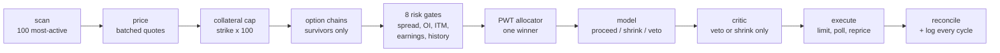

# Attention Weighted

**A short-dated put-writing agent that decides which trade gets the capital.**

It sells cash-secured puts on a 3-4 day tenor, harvesting the gap between what
options imply and what the underlying actually does. Every fifteen minutes it
scans the market for itself, prices the chains, runs eight risk gates, and then
solves the problem most trading bots skip entirely: *several candidates
qualified, capital is finite, which one gets funded?*

Built for the Alpaca AI Trading Agents Hackathon, and traded live on a paper
account for the scored window: 31 Aug to 3 Sep 2026.

```
python run.py --once --dry     # one cycle, decides everything, sends nothing
python run.py                  # the live loop, until the Thursday mark
python tools/selftest.py       # 130 assertions, no network, no credentials
```

Python 3.11, `uv venv .venv && uv pip install -e .`, then copy `.env.example`
to `.env` and add Alpaca keys. Full command list under [Running it](#running-it).

---

## How a cycle runs



The model sits at step 7 of 9, sees one already-vetted candidate, holds no
tools, and can only make the position smaller or refuse it. Everything that
selects is deterministic and testable.

---

## The narrow thing it does well

This is not a general trading system and does not pretend to be. It writes puts
on one expiry, in a delta band, on names it selects fresh each session, and
that narrowness is what makes every part of it testable.

**The edge it claims:** implied volatility usually exceeds realised volatility.
The agent measures both, per name, from live chains and daily bars, and
allocates toward the widest gap. It does not forecast direction, and nothing in
it is trained.

**Where the tenor comes from:** the term structure of the variance risk premium
slopes downward (NY Fed SR 736), so short-dated is where the premium is
densest. The expiry deliberately lands one day *after* the scoring mark, so
almost all the decay is captured and nothing settles inside the measured
window.

**What it refuses to do:** buy calls or puts (that pays the premium instead of
collecting it), sell uncovered calls (unbounded loss, and Alpaca rejects it at
this account level), use margin (buying power is 4x equity; the drawdown
breaker would fire on a 3.25% move instead of 7%), or close winners early
(unrealised P&L already counts at the mark, so buying them back just pays the
spread).

---

## What makes it different

Most agents in this category are a language model with a broker attached. The
model picks the trade. Here the model cannot pick anything.

| | typical | this |
|---|---|---|
| what chooses the trade | the LLM | a deterministic index policy |
| what the LLM can do | anything it emits | veto, or shrink. Nothing else |
| what it holds | tools, order placement | no tools at all |
| on model failure | undefined | fails closed, no trade |
| universe | a hardcoded list | scanned live, re-scanned each session |
| risk controls | prompt instructions | eight gates the model never sees past |

The allocation policy is the novelty, and it is one scalar:

```
pwt = w*age - ubt + opbt + lambda*rank(edge) - mu*crowding
```

Score every runnable candidate, take the highest, recompute from scratch next
cycle. A fair queue for capital: everyone waits their turn, whoever just got
funded goes to the back, better-value contracts move up, and anything
correlated with what you already hold moves down.

---

## Seen live

From the competition account, 1 Sep 2026:

```
gates: 3 passed / 4 evaluated
   x INTC  g2 position_cap: already holding this exact contract

ticker   signal  age    ubt   opbt   rwd   corr      pwt   sel
HOOD      0.536    1  0.200  0.699  0.19  +0.00    0.860   <-- SELECTED
DRAM      0.492    3  0.000  0.791  0.11  +0.88    0.715
NVDA      0.325    2  0.000  0.472  0.04  +0.56    0.289

LLM    [featherless] PROCEED x1.00
CRITIC [featherless] PROCEED x1.00  (concurred)
ORDER  HOOD260904P00100000  filled 1/1  fill 0.77  slippage +0.020
```

Three things in that one cycle that are worth more than the P&L:

- **the agent refused to double into a contract it already held** (gate 2), on
  its own, before anything with judgment was consulted;
- **the winner was not the highest signal.** HOOD won on measured variance risk
  premium while DRAM and NVDA were penalised for correlating with the existing
  book;
- **both model passes are recorded**, including when the second overrides the
  first. On another cycle the critic vetoed a trade for a "2-day tenor
  inconsistent with a 4 Sep expiry" -- and it was right. The agent had computed
  days-to-expiry in the wrong timezone. The adversarial pass caught a defect in
  the first pass's own inputs.

---

## The idea

When several candidates qualify at once, something has to pick which one gets
capital. The obvious answer is to take the highest signal, but that pours every
cycle into whichever name is loudest and starves everything else.

So the allocator is an **index policy**: score every runnable candidate on one
scalar, take the highest, recompute from scratch next cycle.

```
pwt = w*age - ubt + opbt + lambda*rank(edge)     select max(pwt)
```

| term | meaning here |
|---|---|
| `age` | cycles since this ticker first became runnable and was passed over |
| `ubt` | collateral-days this ticker has already consumed |
| `opbt` | committed resource-time of every **other** queued candidate |
| `rank(edge)` | this ticker's rank on **variance risk premium**: implied vol minus realised |

Three properties fall out of that, and none of them is a rule we wrote:

- **Nothing starves.** Winning charges `ubt`, which is subtracted, so an
  incumbent's own success pushes it down the ranking until someone else
  overtakes it. The loudest name cannot monopolise capital.
- **Capital efficiency.** `opbt` excludes the candidate itself, so a name
  demanding more equity for longer scores *lower*. Cheaper, shorter commitments
  are preferred automatically.
- **Diversification.** A ticker already holding capital carries high `ubt` and
  drops down the ranking, without any concentration limit being coded.

`age` had to be repaired to make the first of those true. It was originally
"cycles since this ticker first became runnable", set once and never moved --
so every candidate that qualified together carried an identical age forever,
the term cancelled out of every comparison, and all the anti-starvation was
actually coming from `ubt`. Live cycles showed it plainly: every runnable name
sitting at the same number. It now resets when a ticker receives capital, so it
means "cycles since last funded", which is the classic aging term and the thing
this index was documented as having all along.

That repair needs a weight, because the terms are not in the same units. `age`
counts cycles; `ubt` and `opbt` are equity-fraction-days, and a typical win
charges about 0.09 of `ubt`. Unweighted, one cycle of waiting would outrank
eleven wins' worth of consumed capital -- not an index policy, just round-robin
with extra arithmetic. `AGE_WEIGHT = 0.1` makes one cycle of waiting worth
roughly one win's worth of capital, by construction rather than by fitting.

### Why this is not a forced analogy

Gittins (1979) showed that the optimal policy for allocating a scarce resource
sequentially under contention reduces to an index policy: one scalar per
alternative, take the max. PWT is an index policy with an explicit fairness
term, which is the standard restless-bandit-with-fairness shape.

We claim structural fit, not optimality. A real Gittins index needs a stochastic
reward model, and four sessions is nowhere near enough data to estimate one.

The reward term was added after the first version shipped without one. The
distinction that makes it admissible is that it is *observed* rather than
*predicted*: the bid, the strike, the delta and the days are all read off the
contract in front of us. The signal, by contrast, is a weak opinion about the
future, which is why it still gates admission and still never ranks. Ranking on
it would be inventing precision; ranking on the premium a contract actually
pays is arithmetic.

The `1 - abs(delta)` factor is load-bearing rather than decorative. Raw premium
yield ranks whatever sits closest to the money highest, every single time,
because that is where the premium is. An index maximising it would
systematically select maximum assignment risk and report it as efficiency.

"Attention Weighted" refers to this allocation layer, not to neural attention.
Nothing in this system is trained.

---

## Does it earn its place?

`tools/ablation.py` runs five allocation policies over the same candidate
stream. Synthetic, seeded, reproducible.

| policy | tickers | starved | HHI | worst gap | capital-time | premium/capital-day |
|---|---|---|---|---|---|---|
| pwt | 5/5 | 0 | 0.221 | 8 | 0.709 | 90.6 |
| pwt+reward | 5/5 | 0 | 0.221 | 8 | 0.709 | 91.6 |
| greedy | 1/5 | 4 | 1.00 | 40 | 0.712 | 150.9 |
| random | 5/5 | 0 | 0.214 | 16 | 0.744 | 90.6 |
| roundrobin | 5/5 | 0 | 0.200 | 5 | 0.766 | 91.3 |

### A correction to an earlier version of this table

An earlier fixture gave every contract the same `bid` of 1.10. Premium per
capital-day is `premium / capital-time`, so with the numerator held constant
that column reduces to `1 / capital-time`, which is the quantity PWT minimises
by construction. The metric was measuring the policy against itself, and the
13.8% and 10.2% margins it produced over random and round-robin were artifacts.
They are withdrawn.

With realistic premium dispersion, and with gate 2 applied so the allocator
only arbitrates over names the agent could actually hold, PWT does **not** beat
round-robin on premium yield. The three of them tie at roughly 90 to 91.

What PWT does buy, and what the table above supports:

- **Bounded rotation latency.** Worst gap 8 against random's 16. Random
  diversifies on average and abandons individual names for long stretches; the
  index policy has an actual bound.
- **Capital efficiency.** 0.709 capital-time per trade against 0.744 and 0.766.
  It reaches the same premium while committing less equity for less time.
- **No starvation, without a rule saying so.** Round-robin also achieves this,
  but only because rotation is the entire policy, so it cannot respond to
  anything else.

Greedy earns 150.9, far above everything else, and we are not hiding that. It
also starves four of five tickers and never touches them across forty cycles.
That is concentration risk this metric does not price, and on four sessions of
live trading it is the difference between one good week and one catastrophic
one.

### What the reward term is worth

`pwt+reward` adds `lambda x rank(premium yield)` to the index, where yield is
`(bid / strike) x (1 - |delta|) / dte`. Every input is read off the quote, so
it is arithmetic on the contract in front of us rather than a forecast, which
is what makes it admissible where the signal is not.

At the shipped `lambda = 0.3` it is worth **+1.1%** premium per capital-day
with no change to starvation, concentration, or worst gap. Raising lambda keeps
buying yield: +3.9% at 1.0, +9.7% at 5.0.

We ship 0.3 anyway, for a reason worth stating. Reward is scored on rank, so
with `n` contenders the gap between adjacent ranks is `lambda / (n - 1)` -- the
term is four times stronger in a two-horse race than in a five-horse one.
Lambda tuned on the five-name fixture and shipped at 1.0 breaks rotation
outright when only two candidates clear the gates: the incumbent keeps the seat
even after paying `ubt` for it. `selftest.py` asserts against exactly this.

Two contenders is not a corner case. It is what a late session looks like once
spreads widen and names get gated out, which is when concentration hurts most.
So lambda is chosen for the smallest contested set rather than the average one,
and +1.1% is taken over +9.7% because the larger number is measured on forty
synthetic cycles and the fairness guarantee is the reason this is an index
policy rather than greedy with extra steps.

`--from-log` replays the same comparison over candidate sets the agent actually
faced live, which turns the simulation into a counterfactual on real data.

---

## Architecture

| # | Layer | File |
|---|---|---|
| 1 | Data | `src/data.py`, `src/mcp_client.py` |
| 2 | State | `src/state.py` |
| 3 | Signal | `src/signal.py` |
| 4 | Gates | `src/gates.py` |
| 5 | Allocation | `src/allocation.py` |
| 6 | LLM decision | `src/decide.py` |
| 7 | Self-critique | `src/decide.py` |
| 8 | Execution | `src/execution.py` |
| 9 | Reconciliation | `src/reconcile.py` |
| 10 | Logging | `src/logbook.py` |

Gates run before the model sees a candidate, and the model holds no tools. It
cannot place an order, re-select, or reach a gate. Its entire surface is a JSON
verdict. A gate the LLM can reason past is not a gate, so we made that
structural instead of promising it in a prompt.

The same reasoning removed the wall clock from its payload. It receives time
deltas and never a timestamp, so reading the polling interval as a signal is
impossible rather than merely forbidden.

The LLM layer fails closed. A timeout, an HTTP error, or unparseable JSON all
mean no trade. The agent is a complete trading system without it.

### Two passes, one direction

A second call sees the same candidate plus the first verdict and argues against
it. It has veto and shrink authority and nothing else, and the two verdicts are
merged by taking the more conservative action and the smaller multiplier. A
critic that likes the trade cannot make it larger, and a critic that dislikes a
veto cannot revive it.

That asymmetry is what makes the second pass safe to add. It can only ever
subtract exposure, so the worst case of a confused critic is a trade we skipped,
never a trade we upsized. `tools/selftest.py` asserts every direction of that
merge, including the one that matters most: the critic failing.

Which is also why the critic, unlike the primary call, does *not* fail closed.
An optional second opinion timing out would otherwise manufacture a zero-trade
week out of a network problem. Its failure is logged and the first verdict
stands.

A third call writes one or two sentences of narration per cycle, including on
cycles where nothing traded. It has no authority over anything and exists so the
log reads as a decision record rather than a table dump.

### Strategy

Cash-secured short puts, single leg, all on the 4 Sep expiry. That expiry lands
after the mark, so almost all the decay is captured and nothing settles inside
the measured window. Strikes target 0.18 delta, the low end of a 16 to 30 band,
with percentage moneyness near 2.1% OTM as the fallback when Alpaca cannot solve
delta.

Black-Scholes is deliberately not that fallback. It needs the implied vol Alpaca
failed to solve, which is exactly why delta was missing in the first place.
Computing a delta from a guessed sigma would fabricate the number we are
claiming to lack.

---

## Running it

```bash
uv venv .venv --python 3.11
uv pip install -e .
cp .env.example .env          # then add Alpaca keys

python tools/selftest.py              # unit regression suite, run after any config edit
python tools/scenarios.py             # failure paths: breaker, assignment, restart, no-fill
python tools/allocation_demo.py              # allocation proof, no credentials
python tools/ablation.py              # PWT vs greedy / random / round-robin
python tools/ablation.py --from-log   # replayed over real logged candidates
python tools/offline_cycle.py         # full cycle against a fake broker
python tools/probe.py                 # live tool discovery, null-Greek census, collateral table
python tools/bench.py <model...>      # model fitness: parse rate, judgment, discipline
python tools/report.py                # render the newest run as a shareable HTML report
python tools/scan.py                  # what the market scan would pick, changes nothing
python run.py --once --dry            # one live cycle, no order sent
python run.py                         # the loop
python run.py --comp                  # the competition account
python run.py --flatten               # emergency: close all shorts and stop

powershell -ExecutionPolicy Bypass -File keepalive.ps1 -Comp   # supervised
```

`run.py` on its own already spans the whole window: it sleeps through closed
hours, wakes at the open, and stops itself at the Thursday mark. A bad cycle is
caught and logged rather than ending the run.

`keepalive.ps1` covers what that cannot. The MCP connection is opened outside
the cycle loop, so if `alpaca-mcp-server` dies the agent keeps logging "cycle
raised" every tick without ever reconnecting -- a zombie that looks alive in
the log. Only a process restart clears it, and the supervisor also survives a
dropped network, an exception escaping `asyncio.run`, and an overnight Windows
reboot. It backs off exponentially so a config error cannot spin for four days,
and stops at the mark rather than restarting into a market that cannot score.

Restarting is safe by construction: state is written atomically with a `.bak`,
and each order carries a deterministic `client_order_id` the executor checks
before placing anything, so a restart mid-order adopts the existing order
rather than duplicating it. `tools/scenarios.py` covers that path.

Disable sleep before a live run, or the OS suspends the process regardless:

```
powercfg /change standby-timeout-ac 0
powercfg /change hibernate-timeout-ac 0
```

`--comp` is the only thing standing between the dev account and the scored one.

### Where the universe comes from

Built from the live market at startup, not from a list in a file. Screener for
the most-active names, one batched quote call per 25 to filter on price, the
collateral cap (`strike x 100` inside `PER_POSITION_CAP`, which removes most of
the market on price alone), then chains for the survivors, then **the real
gates** on each target contract, then ranked on the same `expected_yield` the
allocator scores.

Running the actual gates is the part that matters. Ranking on yield alone
returned names the agent would reject on sight -- PATH quoted 0.15 wide on a
0.22 bid, a 51% spread against a 20% limit, ranked second. A universe of
contracts that fail gate 3 is a zero-trade week wearing the costume of a scan.

Yield ranking also ranks *volatility*, since volatility is what pays premium.
Unfiltered it chose SOXL, SOXS, TQQQ and SQQQ -- 3x leveraged funds including a
long/short pair on one underlying it proposed selling puts on simultaneously --
then CIFR, BMNR and MSTR, a miner, a treasury company and a bitcoin proxy.
Equities by listing, crypto by risk. Both categories are excluded by name.

The hardcoded list in `config.py` is the fallback and stays the fallback. A scan
that fails, or that yields fewer tradeable names than PWT needs to arbitrate
between, leaves it untouched, and `src/universe.scan` never raises. A universe
is not worth a session.

One thing the scan cannot do is check earnings: Alpaca exposes no calendar
through the MCP server. The configured list has hand-verified earnings and
ex-dividend dates; a scanned one does not, and startup says so every run.
`--no-scan` forces the verified list.

Run `selftest.py` after touching `config.py`. Every knob in there is one edit
away from silently disarming a risk gate, and a disarmed gate raises no
exception. It just stops enforcing. The suite covers all gate rejection paths,
OCC parsing, the OPBT-excludes-self property, signal tie handling, fail-closed
LLM coercion, and session rollover.

`scenarios.py` is the other half. It drives the real agent against a broker
rigged to misbehave, and checks the safety machinery actually engages: the
breaker firing and closing the nearest-the-money short, assignment spotted by
diffing positions, a crash-restart not resending an order it already placed, an
unparseable symbol halting entries instead of mis-capping the portfolio, and an
order that never fills backing out cleanly.

### Safety rails

| Rail | Behaviour |
|---|---|
| Circuit breaker | 3% drawdown against the day's high-water mark halts entries and closes the highest-delta short |
| Unparseable position symbol | Halts entries rather than cap the portfolio against an understated number |
| Daily order cap | 10 per session; exceeding it trips the breaker, since something is looping |
| LLM failure | Fails closed, no trade |
| `--flatten` | Human-only. The agent has no self-flatten path, because one would eventually fire for a bad reason |
| State corruption | Atomic writes, plus a `.bak` of the last good copy |

---

## Six ways this was wrong, and how each was caught

Every one of these ran green in the unit tests. None raised an exception. They
are listed because a system that has never been caught being wrong has not been
looked at hard enough, and because the method that found each one is more
transferable than the fix.

**Every order was being rejected, silently.** `place_option_order` wants `qty`
and `limit_price` as *strings* and rejects unknown keyword arguments -- and we
sent numbers plus three defensive aliases. The rejection came back as a
*return value*, not an exception, so the executor went on to poll for an order
that never existed. Four days of cycles would have placed nothing and logged
nothing resembling an error. Found by sending one deliberately unfillable order
against the live endpoint. `--dry` could never have caught it, because `--dry`
stops one step before submission.

**The model returned empty content on every call.** Asking for
`response_format: json_object` produced HTTP 200, `finish_reason: "stop"`, and
an empty `content` -- the whole answer went to a separate `reasoning` field.
Since the layer fails closed, that vetoes every trade of the week while the log
shows ordinary-looking vetoes. Found by calling the provider directly instead
of trusting the wrapper.

**Daily bars had been 403ing since the first commit.** The free tier needs
`feed=iex`; the default SIP feed refuses any range ending in the recent window,
and ours always ends yesterday. The error arrived as a 200 with an error body,
so `realized_vol` and `momentum` returned None for every ticker on every cycle
while the signal kept producing plausible numbers off its remaining input.

**Days-to-expiry was computed in the wrong timezone.** The machine runs UTC+8,
so `date.today()` was already tomorrow in market terms and a 4 Sep contract
read as 2 DTE instead of 3. That inflated the reward term by half and
understated capital-time. The *critic* caught it: it vetoed two consecutive
trades for "a 2-day tenor inconsistent with a 4 Sep expiry," which was exactly
right. The second opinion found a defect in the first opinion's inputs.

**The crowding term exempted the thing it should have punished most.** A
candidate on an already-held underlying was skipped rather than penalised, on
the reasoning that a name should not be correlated with itself. Backwards -- a
second HOOD put moves with the first one exactly. It bought HOOD 99 while
holding HOOD 100 and put 58% of the book in one name before this was found.

**The ablation was measuring itself.** The fixture gave every contract the same
`bid`, so "premium per capital-day" reduced to `1 / capital-time` -- the
quantity PWT minimises by construction. The 13.8% and 10.2% margins it reported
were artifacts. Rebuilt with real premium dispersion, the advantage over
round-robin disappeared, and the claim was withdrawn from this README rather
than restated.

The pattern is consistent: **the bugs that survive are the ones that do not
raise errors.** Everything that crashed was fixed on day one. What was left ran
cleanly and did the wrong thing quietly, which is also why the tests kept
passing. Four of the six were found only by reading real output from a live
run.

---

## What testing found

Three defects that would never have raised an exception.

The port computed OPBT from the candidate's own size instead of the others',
biasing the allocator toward the largest and longest-dated position. That is the
opposite of capital efficiency and the opposite of the source algorithm. Caught
by re-deriving the term from first principles.

Tied signals ranked at the floor. A naive "count strictly below" ranking scores a
fully tied pool at 0.0. Implied vol clusters across this universe, so every
ticker would have failed the admission floor and the agent would have traded zero
times in four days. Ties now take the mid-rank.

Gate 8 is dormant. The earnings exclusion list has no overlap with the universe,
so it cannot fire. It is insurance against a universe change, not an active
control, and it is counted that way rather than claimed as one of eight live
gates.

---

## What we expect

A book of short puts is a long-delta position. Over four sessions, premium
capture is around 0.09%, and a 1% move in the universe swamps it. Cboe's own
research (Bondarenko, 2019) has WPUT at 5.6% a year against PUT at 6.6% and the
S&P at 7.1% from 2006 to 2015. Weekly put-writing collects far more gross premium
and returns less. It wins on drawdown, not on return.

So P&L over this window is substantially a coin flip on direction, and we are not
going to present one week of it as evidence of edge.

Whatever structural edge exists comes from implied vol tending to overstate
realised vol, which is visible over many trades and unprovable in four days.
Short-dated is where that premium is densest: the term structure of the price of
variance risk slopes downward (NY Fed SR 736), so the 4 Sep expiry is an economic
choice and not only an artifact of the scoring window.

The metrics we report stay meaningful either way, and land in
`runs/<ts>/metrics.json`: capital utilisation, mean candidate wait-cycles,
Herfindahl concentration, premium per capital-day, and measured slippage.

---

## Execution semantics and reproducibility

Audits of LLM-trading research find execution timing under-specified in most
studies, cost treatment recoverable in fewer than half, and reproducibility rare.
Against the reporting standard they propose:

| Item | This system |
|---|---|
| Universe and inclusion rules | `config.UNIVERSE_CANDIDATES`, pruned by the collateral check (`strike x 100` at or below 25% of equity) |
| Data provenance | Alpaca via `alpaca-mcp-server`, free tier. Latest quotes are real-time; historical bars carry a 15-minute delay. Every cycle is timestamped |
| Point-in-time discipline | Structurally impossible to violate. No backtest, no training, no fitted parameters. The agent trades forward on data that did not exist when it was written |
| Train/validation/test splits | None. Nothing is trained |
| Execution timing | 15-minute cycle, 09:30 to 15:45 ET. Sell-to-open limit priced at or through the bid, since paper only fills marketable orders. Day TIF. Polling backs off from 0.5s to 8s over a 90s timeout, then cancels and re-prices one cent through, up to twice |
| Transaction costs | Measured rather than assumed. `fill_price - quote_mid` per fill, aggregated as mean and worst slippage, total cost, and share of gross premium |
| Model versions and prompts | Logged per decision. System prompt lives in `src/decide.py`. MCP tool names are resolved at runtime and printed at startup |
| Seeds and retry policy | No randomness in the decision path. Ties break on `(-spread, ticker)`. `ablation.py` is seeded |
| Artifact release | This repo: code, prompt, config, per-cycle logs, metrics, ablation harness |

One gap we do not close. An LLM provider can change model versions underneath us
mid-run. It is logged per decision, so at least the drift is visible.

---

## What a run leaves behind

Every run writes to `runs/<timestamp>/`:

| file | what it is |
|---|---|
| `cycles.jsonl` | one record per cycle, the auditable trace. Replayable by `ablation.py --from-log` |
| `console.log` | the readable transcript, exactly as it appeared in the terminal |
| `metrics.json` | the aggregate numbers, written at finalise |
| `report.html` | generated on demand by `tools/report.py` |

`runs/supervisor.log` records every restart when running under `keepalive.ps1`.

The transcript exists because a four-day unattended run outlives any terminal
scrollback, and a supervisor restart opens a new window. The JSONL is what you
replay; the transcript is what you read.

`tools/report.py` renders a run as a single self-contained HTML file: metrics
first, then every cycle in order with the gates that rejected candidates, the
allocation table that arbitrated between the survivors, both model verdicts,
and the fill. No external CSS, fonts, or scripts, so it opens offline.

No-trade cycles are included deliberately, and are most of them. A report
containing only trades cannot show the agent declining for good reasons, which
is half of what the run is evidence of.

---

## Disclosure

Pre-event work: `BUILD.md`, the specification. No code predates the event. The
repository was initialised during the hackathon and every module in `src/` was
written for it.

Third-party components: `alpaca-mcp-server` (Alpaca, run via `uvx`), and
`alpacahq/alpaca-skills` (Apache 2.0), which we read for reference but did not
vendor. It shaped three choices: resolving MCP tool names at runtime, building
order arguments from the tool's own schema, and proving paper mode from the
config flag rather than from an account response. Plus `mcp`, `httpx`,
`python-dotenv`, `tzdata`, and `anthropic`.

AI assistance: developed with AI coding assistance. The runtime LLM layer is a
separate, provider-agnostic API call in `src/decide.py`.

Not used: no trained model, no RAG, no vector store, no backtest-fitted
parameters. Signal weights in `config.py` are hand-designed, because four
sessions and a handful of trades is not data you can fit anything to.

---

## Disclaimers

Paper trading only. Not investment advice. Paper-trading results are hypothetical
and do not represent actual trading. Options trading is not suitable for all
investors; see
[Characteristics and Risks of Standardized Options](https://www.theocc.com/company-information/documents-and-archives/options-disclosure-document).
